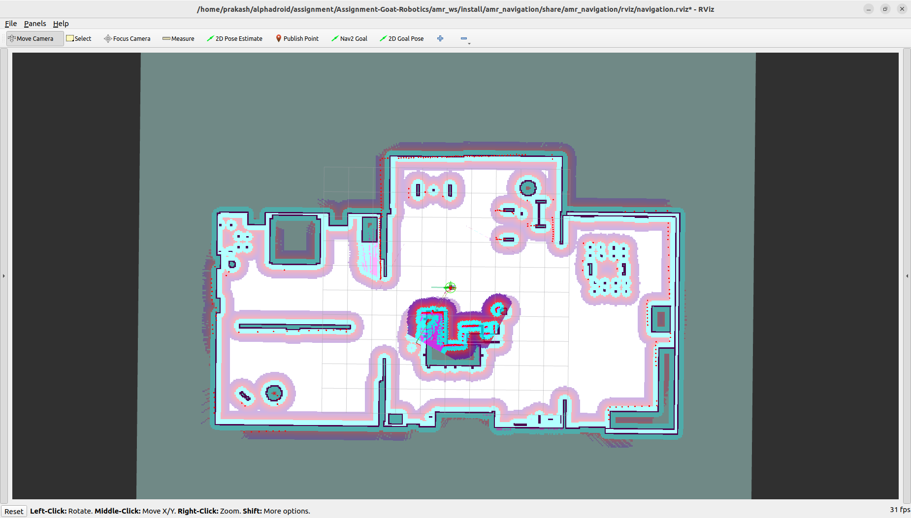

# Assignment-Goat-Robotics

## Installation & Setup
Before launching the robot, ensure that you have sourced your ROS 2 Humble environment and workspace:
```bash
source /opt/ros/humble/setup.bash
source install/setup.bash
```

## Launching the Simulation

### 1. Launch the Robot in Gazebo

This command starts the robot in a simulated environment. You can specify the world file.
```bash
ros2 launch amr_description gazebo.launch.py world_name:=small_house
```
### 2. Start the Robot Controller

This command initializes the robot's controller, enabling movement and interaction.
```bash
ros2 launch amr_controller controller.launch.py
```

### 3. Launch the Navigation Stack

This command starts the navigation module, allowing the robot to autonomously reach its destinations.
```bash
ros2 launch amr_navigation navigation.launch.py
```


# Problem 1

When an order is received, the robot should:

1. ***Move from its home position to the kitchen.***

2. ***Move from the kitchen to the designated table for food delivery.***

3. ***After delivering the food, return to the home position automatically.***

### Implementation

To achieve this, a ROS 2 service is used to send single or multiple goal locations dynamically.

**Running the Delivery System**
```bash
ros2 run amr_utils problem_one.py
```
**Sending a Goal to the Robot**

Use the following command to send a goal (e.g., moving to table1):

```bash
ros2 service call /position_list amr_custom_msg/srv/GoalList "goal_list: [table1]"
```

### Output Video

[](https://drive.google.com/file/d/1OzVE8HLD-lfVHHrgjoURyCafVJnp0MZ4/view?usp=drive_link)


# Problem 2

When an order is received with the table number, the robot should:


1. ***Move from its home position to the specified table to start the task.***

2. ***If no one attends the robot, it will wait for confirmation (either in the kitchen or at the table).***

3. ***If the robot doesn't receive confirmation within a given timeout, it will return to the home position automatically.***

### Implementation

To achieve this, I used two ROS 2 service one for send signal and another one for sending single or multiple goal locations dynamically.

**Running the Delivery System**
```bash
ros2 run amr_utils problem_two.py
```
**Sending a Goal to the Robot**

Use the following command to send a goal (e.g., moving to table1):

```bash
ros2 service call /position_list amr_custom_msg/srv/GoalList "goal_list: [table1]"
```

**Sending Timeout signal for Robot**

Use the following command to send a signal:

```bash
ros2 service call /signal_service amr_custom_msg/srv/DelivarySignal "signal: True" 
```

### Output Video


[](https://drive.google.com/file/d/1R61iM8AflfuBpwEZrKmjbrsb8Ob9-kjh/view?usp=drive_link)

# Problem 3

When an order is received with the table number, the robot should move from home to start its task. We need to handle the following scenario:

a. ***The robot will reach the kitchen for the food, and if no confirmation is given, it should move to the home position after a timeout.***

b. ***If the food is received from the kitchen, the robot reaches the table. If no one gives confirmation from the table, the robot will first return to the kitchen before moving back to the home position.***

### Implementation

To achieve this, a combination of two ROS 2 services is used one to send goal locations and another to handle the confirmation logic.

**Running the Delivery System**
```bash
ros2 run amr_utils problem_three.py
```
**Sending a Goal to the Robot**

Use the following command to send a goal (e.g., moving to table1):

```bash
ros2 service call /position_list amr_custom_msg/srv/GoalList "goal_list: [table1]"
```

**Sending Timeout signal for Robot**

Use the following command to send a signal:

```bash
ros2 service call /signal_service amr_custom_msg/srv/DelivarySignal "signal: True" 
```

### Output Video


[](https://drive.google.com/file/d/1GDcc_1moQXI8WglRCYm_roRAFF52q6jZ/view?usp=drive_link)


# Problem 4

When an order is received with the table number,The robot moves from home to the kitchen and then to the designated table.

a. ***If a task is canceled while going to the table, the robot returns to the kitchen and then to home.***

b. ***If a task is canceled while going to the kitchen, the robot will return to home.***

### Implementation

To achieve this, a combination of two ROS 2 services is used one to send goal locations and another to handle the confirmation logic.

**Running the Delivery System**
```bash
ros2 run amr_utils problem_three.py
```
**Sending a Goal to the Robot**

Use the following command to send a goal (e.g., moving to table1):

```bash
ros2 service call /position_list amr_custom_msg/srv/GoalList "goal_list: [table1]"
```

**Sending Timeout signal for Robot**

Use the following command to send a signal:

```bash
ros2 service call /signal_service amr_custom_msg/srv/DelivarySignal "signal: True" 
```

**Cancle the Goal**
For cancle the robot goal i used ros2 nav_to_pose default hidden service

```bash
ros2 service call /navigate_to_pose/_action/cancel_goal action_msgs/srv/CancelGoal "goal_info:
  goal_id:
    uuid:
    - 0
    - 0
    - 0
    - 0
    - 0
    - 0
    - 0
    - 0
    nanosec: 0"
```

### Output Video


[](https://drive.google.com/file/d/1IAQ5ZXA6BKtzGbQCX2fxNA5d8A53F6B-/view?usp=drive_link)


# Problem 5

When multiple orders are received with table numbers, the robot should follow this task flow:

1. **Order Received:**  ***The robot moves from home to the kitchen to collect the orders.***

2. **Delivery Process:** ***The robot moves to multiple tables one by one to deliver the food.***

3. **Completion:**  ***After delivering all orders, the robot returns to the home position.***

### Implementation

This is achieved using a ROS 2 service to send multiple goal locations dynamically.

**Running the Multi-Table Delivery System**

To start the system, run the following command:
```bash
ros2 run amr_utils problem_five.py
```
**Sending Multiple Goals to the Robot**

To send multiple table destinations (e.g., table1, table2), use:

```bash
ros2 service call /position_list amr_custom_msg/srv/GoalList "goal_list: [table1,table2]"
```

**Sending Timeout signal for Robot**

Use the following command to send a signal:

```bash
ros2 service call /signal_service amr_custom_msg/srv/DelivarySignal "signal: True" 
```

### Output Video


[](https://drive.google.com/file/d/1FKvtDEKWOuxYA1YKDn0x8-eopBnt2pxw/view?usp=drive_link)

# Problem 6

When multiple orders are received with the table numbers (e.g., table1, table2, table3), the robot should follow this task flow:

1. **Order Collection:**  ***The robot moves from home to the kitchen to collect the orders.***

2. **Delivery Process:** ***The robot moves to multiple tables one by one to deliver the food.***

3. **Handling Unconfirmed Orders:**  ***If no one confirms at `table1`, the robot moves to the next available tables (table2, table3).***

4. **Return to Kitchen**  ***After finishing the delivery of the final table, the robot goes to the kitchen before moving to the home position.***


### Implementation

A ROS 2 service is used to dynamically update the robot's navigation sequence based on real-time confirmations.

**Running the Conditional Multi-Table Delivery System**

To start the system, run the following command:
```bash
ros2 run amr_utils problem_six.py
```
**Sending Multiple Goals to the Robot**

To send multiple table destinations (e.g., table1, table2), use:

```bash
ros2 service call /position_list amr_custom_msg/srv/GoalList "goal_list: [table1,table2,table3]"
```

**Sending Timeout signal for Robot**

Use the following command to send a signal:

```bash
ros2 service call /signal_service amr_custom_msg/srv/DelivarySignal "signal: True" 
```

### Output Video


[](https://drive.google.com/file/d/1yGHfdUcPNS4wYxFNj3Sp3vBBL_AQukmj/view?usp=drive_link)

